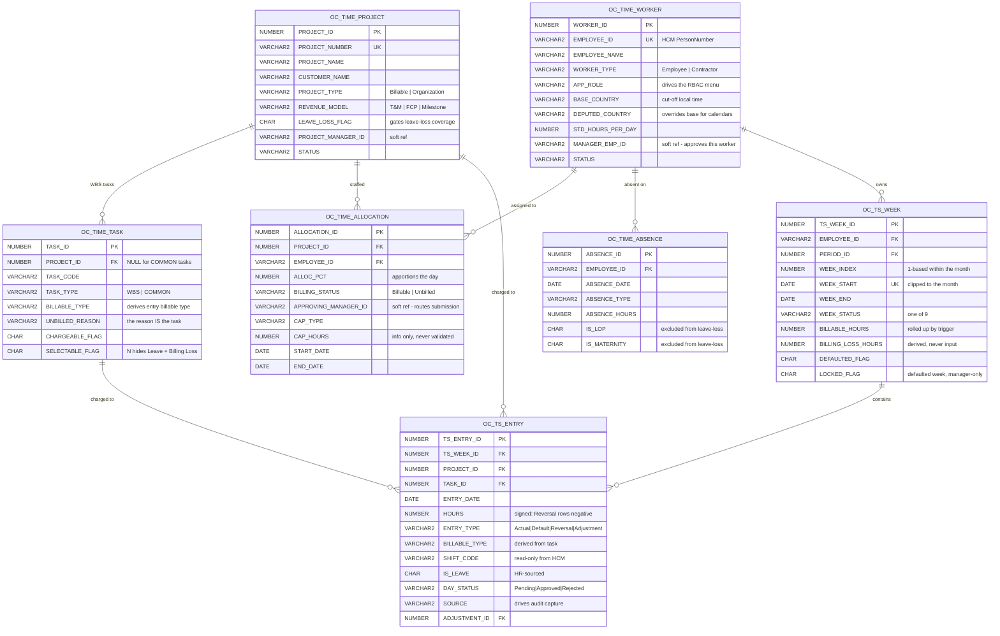
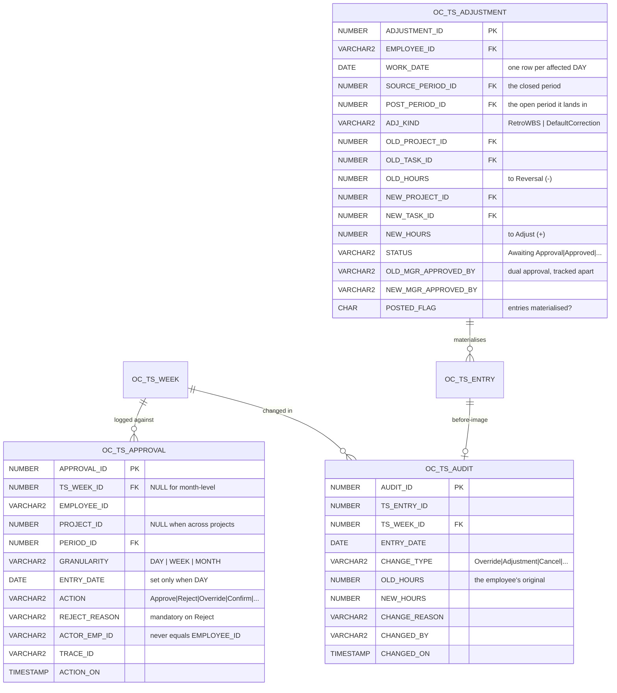
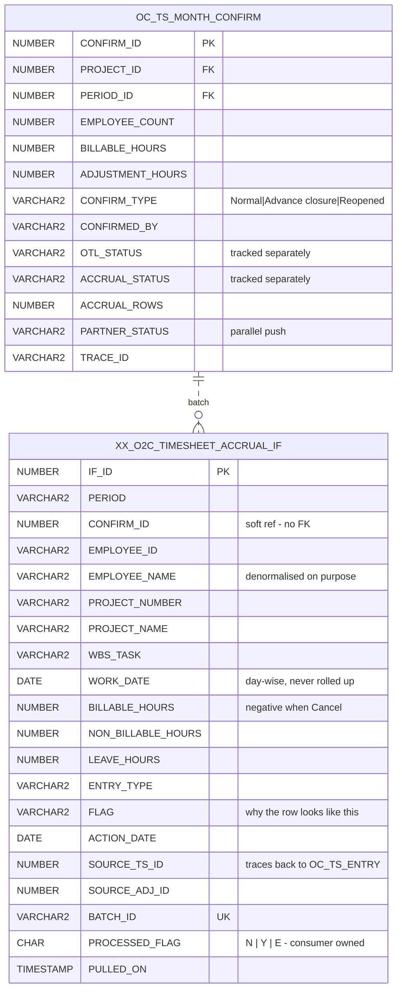
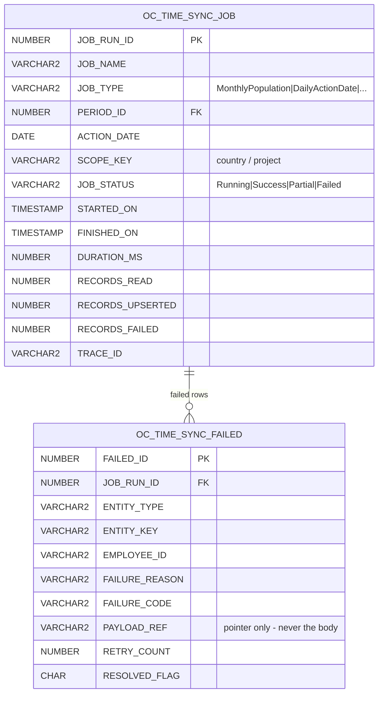

# O2C Timesheet Module — Data Model

21 tables in four layers. Derived from the DDL in this directory, not from the
requirements document — if the two disagree, the DDL is what runs.

```
Layer 4   OPERATIONS & HAND-OFF     sync telemetry · accrual interface
Layer 3   TRANSACTIONAL CORE        weeks · entries · approval · audit · adjustments
Layer 2   FUSION MASTER CACHE       worker · project · task · allocation · absence
Layer 1   REFERENCE & CONFIG        period · calendar · lookup · config
```

Layers only ever depend downward. Nothing in layer 1 or 2 knows the transactional
tables exist, which is what lets the Fusion sync jobs upsert master data freely
without touching time records.

---

## 1. Whole model

```mermaid
erDiagram
  OC_TIME_PERIOD          ||--o{ OC_TS_WEEK              : scopes
  OC_TIME_PERIOD          ||--o{ OC_TS_APPROVAL          : scopes
  OC_TIME_PERIOD          ||--o{ OC_TS_ADJUSTMENT        : "source + post"
  OC_TIME_PERIOD          ||--o{ OC_TS_LEAVE_LOSS_COVER  : scopes
  OC_TIME_PERIOD          ||--o{ OC_TS_SALARY_HOLD       : scopes
  OC_TIME_PERIOD          ||--o{ OC_TS_MONTH_CONFIRM     : scopes
  OC_TIME_PERIOD          ||--o{ OC_TS_CLIENT_DOC        : "billing period"
  OC_TIME_PERIOD          ||--o{ OC_TIME_SYNC_JOB        : scopes

  OC_TIME_WORKER          ||--o{ OC_TIME_ALLOCATION      : "assigned to"
  OC_TIME_WORKER          ||--o{ OC_TIME_ABSENCE         : "absent on"
  OC_TIME_WORKER          ||--o{ OC_TS_WEEK              : owns
  OC_TIME_WORKER          ||--o{ OC_TS_ADJUSTMENT        : "corrects own"
  OC_TIME_WORKER          ||--o{ OC_TS_LEAVE_LOSS_COVER  : "absent or covering"
  OC_TIME_WORKER          ||--o{ OC_TS_SALARY_HOLD       : held

  OC_TIME_PROJECT         ||--o{ OC_TIME_TASK            : "WBS tasks"
  OC_TIME_PROJECT         ||--o{ OC_TIME_ALLOCATION      : staffed
  OC_TIME_PROJECT         ||--o{ OC_TS_ENTRY             : "charged to"
  OC_TIME_PROJECT         ||--o{ OC_TS_ADJUSTMENT        : "old + new"
  OC_TIME_PROJECT         ||--o{ OC_TS_LEAVE_LOSS_COVER  : "FCP cover"
  OC_TIME_PROJECT         ||--o{ OC_TS_MONTH_CONFIRM     : confirmed
  OC_TIME_PROJECT         ||--o{ OC_TS_CLIENT_DOC        : evidences

  OC_TIME_TASK            ||--o{ OC_TS_ENTRY             : "charged to"
  OC_TIME_TASK            ||--o{ OC_TS_ADJUSTMENT        : "old + new"

  OC_TS_WEEK              ||--o{ OC_TS_ENTRY             : contains
  OC_TS_WEEK              ||--o{ OC_TS_APPROVAL          : "logged against"
  OC_TS_WEEK              ||--o{ OC_TS_AUDIT             : "changed in"

  OC_TS_ADJUSTMENT        ||--o{ OC_TS_ENTRY             : "materialises Reversal/Adjustment"

  OC_TIME_SYNC_JOB        ||--o{ OC_TIME_SYNC_FAILED     : "failed rows"

  OC_TS_MONTH_CONFIRM     ||..o{ XX_O2C_TIMESHEET_ACCRUAL_IF : "batch (no FK, by design)"

  OC_TIME_LOOKUP {
    VARCHAR2 LOOKUP_TYPE UK "9 statuses, 8 flags, reasons"
  }
  OC_TIME_CALENDAR {
    VARCHAR2 SCOPE_KEY UK "polymorphic - see section 6"
  }
  OC_TIME_CONFIG {
    VARCHAR2 CONFIG_NAME UK "business settings"
  }
```



`OC_TIME_LOOKUP`, `OC_TIME_CALENDAR` and `OC_TIME_CONFIG` are standalone by
design — see §6.

---

## 2. The spine: master data → the cell

`OC_TS_ENTRY` is the grain of the whole module. Everything else either feeds it
or summarises it.



### Why the cell looks like that

`UK_OC_TSE_CELL (ts_week_id, project_id, task_id, entry_date, entry_type)` is the
whole design in one constraint:

- **`entry_date` in the key** — hours are held per day, never per week. The BRD
  requires day-level approval, day-level rejection and day-wise retro
  adjustments; a weekly total could not support any of them.
- **`entry_type` in the key** — so a `Cancel(−)` and its paired `Adjustment(+)`
  can sit on the *same* project/task/day as the original `Actual` row without
  colliding. That is how the net-off works.
- **`project_id` + `task_id` in the key** — multi-line, multi-task per day is
  explicitly supported (a client-holiday day split into billable + Client
  Holiday).

`HOURS` is signed rather than paired with a debit/credit flag: a consumer can then
`SUM()` and get the net position with no sign logic, which is exactly what the
accrual application does.

---

## 3. Approval, audit and adjustments



Three points worth knowing:

**Adjustments hold both sides in one row.** A retro change is one business
decision, so one row carries the old line and the new line. Splitting it into two
rows would let half of it be approved.

**Two period ids, not one.** `SOURCE_PERIOD_ID` is the closed month the work
actually happened in; `POST_PERIOD_ID` is the open month the net-off is posted
into. A closed book is never reopened, but day-level fidelity is preserved because
the materialised entries keep the original `WORK_DATE`.

**The audit row is written by a trigger, not by application code.**
`TRG_OC_TSE_AUDIT_CAPTURE` fires on any hours/project/task change and keys off
`SOURCE`: an employee editing their own draft is normal editing and is not
retained; anything manager-, job- or import-sourced is. That means the audit trail
cannot be bypassed by writing to ORDS directly.

---

## 4. Month confirmation and the accrual hand-off



**The interface table is deliberately denormalised and deliberately un-FK'd.**

Both follow from one fact: the consumer is a *different application* that does not
share this schema.

- Names are carried alongside ids because the reader cannot join to
  `OC_TIME_WORKER` or `OC_TIME_PROJECT`.
- `CONFIRM_ID` is a plain number, not a foreign key, so the consumer can copy,
  archive or purge rows on its own schedule without a dependency back into ours —
  and so our retention policy is not hostage to theirs.
- `PROCESSED_FLAG` / `PULLED_ON` / `BATCH_ID` are *consumer-owned* columns. They
  are the only columns anything outside this module writes.

`OTL_STATUS`, `ACCRUAL_STATUS` and `PARTNER_STATUS` are three separate columns
rather than one because the three destinations fail independently — OTL can reject
a time card while the accrual hand-off is perfectly fine, and collapsing them
would lose which one needs attention.

---

## 5. Operations



`JOB_STATUS` cannot be `Success` while `RECORDS_FAILED > 0` —
`TRG_OC_TSJ_DURATION` downgrades it to `Partial`. The alert threshold is
`failure_count > 0`, so a green status next to failed records would defeat the
monitoring.

`PAYLOAD_REF` holds a pointer, never the payload: the Security sheet forbids
request/response bodies in production, and worker and absence data is PII.

---

## 6. Tables with no foreign keys, and why

| Table | Why standalone |
|---|---|
| `OC_TIME_LOOKUP` | A dictionary keyed `(lookup_type, lookup_code)`. Values are referenced by `CHECK` constraints, not FKs, so an invalid status is rejected at insert rather than being merely unjoinable. |
| `OC_TIME_CALENDAR` | `SCOPE_KEY` is polymorphic by nature — a country for CORPORATE, a customer for CLIENT, a project id for PROJECT, an employee id for SHIFT. No single FK target exists. |
| `OC_TIME_CONFIG` | Environment/business settings keyed `(config_name, scope_key)`. Nothing references a config row by id. |
| `XX_O2C_TIMESHEET_ACCRUAL_IF` | Cross-application interface — see §4. |

### Soft references (intentionally not FKs)

| Column | Points at | Why no constraint |
|---|---|---|
| `OC_TIME_WORKER.MANAGER_EMP_ID` | `OC_TIME_WORKER.EMPLOYEE_ID` | The Fusion sync has no guaranteed order; a report can land before their manager. An FK would fail the sync rather than the lookup. |
| `OC_TIME_PROJECT.PROJECT_MANAGER_ID` | `OC_TIME_WORKER.EMPLOYEE_ID` | Same — projects and workers sync from different Fusion resources. |
| `OC_TIME_ALLOCATION.APPROVING_MANAGER_ID` | `OC_TIME_WORKER.EMPLOYEE_ID` | Same. |
| `OC_TS_ENTRY.APPROVED_BY`, `*_BY` columns | — | Audit strings hold the actor's email as it was at the time. Resolving to a current worker row would rewrite history when someone leaves. |

---

## 7. Constraints that carry business rules

These are the ones where the model, not the code, is the enforcement point.

| Constraint | Table | Rule |
|---|---|---|
| `UK_OC_TP_SINGLE_OPEN` | `OC_TIME_PERIOD` | RULE-017 — function-based unique index on `CASE WHEN status='Open' THEN 'OPEN' END`. A second open period is not representable. |
| `TRG_OC_TP_NO_OVERLAP` | `OC_TIME_PERIOD` | RULE-018 — compound trigger; statement-level so it can query its own table. |
| `CHK_OC_TSE_QUARTER` | `OC_TS_ENTRY` | RULE-005 — `MOD(ABS(hours)*100, 25) = 0`. Uses `ABS` so negative Reversal rows validate identically. |
| `CHK_OC_TSE_UNBILLED` | `OC_TS_ENTRY` | RULE-002 — non-billable hours must carry a reason. |
| `CHK_OC_TSE_CELL` / `UK_OC_TSE_CELL` | `OC_TS_ENTRY` | The grain — see §2. |
| `CHK_OC_TSA_SELF` | `OC_TS_APPROVAL` | RULE-015 — `actor_emp_id <> employee_id` for every approving action. Self-approval cannot be recorded. |
| `CHK_OC_TSA_REJ_REQ` | `OC_TS_APPROVAL` | RULE-013 — a `Reject` row without a reason is invalid. |
| `TRG_OC_TSADJ_WINDOW` | `OC_TS_ADJUSTMENT` | RULE-019 — reads the post period's own `ADJUSTMENT_MONTHS`, so finance widens the window by changing data, not code. |
| `UK_OC_TSLLC_COVER_DAY` | `OC_TS_LEAVE_LOSS_COVER` | RULE-014 — one colleague cannot cover two absentees on the same day. |
| `CHK_OC_TSLLC_SELF` | `OC_TS_LEAVE_LOSS_COVER` | Nobody covers themselves. |
| `CHK_OC_TSCD_SIZE` / `CHK_OC_TSCD_MIME` | `OC_TS_CLIENT_DOC` | 25 MB ceiling and MIME whitelist, enforced below the API. |
| `CHK_XX_TSIF_SIGN` | `XX_O2C_..._IF` | `Cancel` rows must be ≤ 0 and everything else ≥ 0, so the consumer's `SUM()` is always the net position. |
| `UK_XX_TSIF_ROW` | `XX_O2C_..._IF` | Re-confirming a month cannot double-post. |
| `UK_OC_TTSK_WBS` / `UK_OC_TTSK_COMMON` | `OC_TIME_TASK` | Two partial unique indexes: WBS codes unique per project, COMMON codes globally unique. Needed because `PROJECT_ID` is NULL for common tasks. |

### Derived columns — never inputs

| Column | Derived by |
|---|---|
| `OC_TS_WEEK.BILLABLE_HOURS`, `NON_BILLABLE_HOURS`, `LEAVE_HOURS`, `STANDARD_HOURS` | `TRG_OC_TSW_TOTALS`, recomputed from the entries on any line change |
| `OC_TS_WEEK.BILLING_LOSS_HOURS` | RULE-009 — `max(0, standard − billable − leave)` |
| `OC_TS_WEEK.TOTAL_HOURS` | `TRG_OC_TSW_AUDIT` |
| `OC_TS_WEEK.HAS_REVERSAL_FLAG`, `HAS_ADJUSTMENT_FLAG` | `TRG_OC_TSW_TOTALS` |
| `OC_TS_ENTRY.BILLABLE_TYPE`, `UNBILLED_REASON` | `TRG_OC_TSE_DERIVE`, from the task — the billable type is never typed by a user |
| `OC_TIME_CALENDAR.PRECEDENCE` | `TRG_OC_TC_PRECEDENCE`, from `LAYER`, so a caller cannot set an inconsistent precedence |
| `OC_TIME_SYNC_JOB.DURATION_MS` | `TRG_OC_TSJ_DURATION` |
| `OC_TS_SALARY_HOLD.WINDOW_EXPIRES_ON` | `TRG_OC_TSSH_WINDOW`, from the period's `HOLD_RELEASE_DAYS` |

---

## 8. Table catalogue

Grain = what one row means. Get this wrong and everything downstream double-counts.

### Layer 1 — Reference & configuration

| Table | Cols | Grain |
|---|---|---|
| `OC_TIME_LOOKUP` | 12 | One allowed value per `(lookup_type, lookup_code)` |
| `OC_TIME_PERIOD` | 26 | One accounting period, optionally per payroll country |
| `OC_TIME_CALENDAR` | 15 | One calendar day per `(layer, scope_key, cal_date)` |
| `OC_TIME_CONFIG` | 10 | One setting per `(config_name, scope_key)` |

### Layer 2 — Fusion master cache

| Table | Cols | Grain |
|---|---|---|
| `OC_TIME_WORKER` | 20 | One worker, keyed on HCM PersonNumber |
| `OC_TIME_PROJECT` | 20 | One project, keyed on project number |
| `OC_TIME_TASK` | 17 | One task — WBS (project-scoped) or COMMON (global) |
| `OC_TIME_ALLOCATION` | 18 | One resource assignment per `(project, employee, start_date)` |
| `OC_TIME_ABSENCE` | 14 | One absence per `(employee, date, type)` |

### Layer 3 — Transactional core

| Table | Cols | Grain |
|---|---|---|
| `OC_TS_WEEK` | 34 | One employee-week, **clipped to the month** |
| `OC_TS_ENTRY` | 24 | **The cell** — week × project × task × day × entry type |
| `OC_TS_APPROVAL` | 14 | One approval event (append-only) |
| `OC_TS_AUDIT` | 20 | One before-image of a changed hour |
| `OC_TS_ADJUSTMENT` | 24 | One day-wise retro change, both sides |
| `OC_TS_LEAVE_LOSS_COVER` | 19 | One absentee-day per project |
| `OC_TS_SALARY_HOLD` | 19 | One hold per `(employee, period)` |
| `OC_TS_MONTH_CONFIRM` | 23 | One confirmation per `(project, period)` |
| `OC_TS_CLIENT_DOC` | 12 | One uploaded document |

### Layer 4 — Operations & hand-off

| Table | Cols | Grain |
|---|---|---|
| `OC_TIME_SYNC_JOB` | 16 | One job run |
| `OC_TIME_SYNC_FAILED` | 15 | One failed record within a run |
| `XX_O2C_TIMESHEET_ACCRUAL_IF` | 33 | One interface row — employee × project × task × day × entry type |

---

## 9. Views

24 views, all read-only and all dating in `YYYY-MM-DD` so ORDS emits ISO strings
and VBCS needs no date coercion.

| View | Serves |
|---|---|
| `V_OC_TS_WEEK_GRID` | The employee weekly grid, hours pivoted Mon–Sun |
| `V_OC_TS_DAY_SHIFT` | Per-day shift + standard hours row |
| `V_OC_TS_MY_PERIODS` | Month LOV with `editable_flag` / `adjustment_allowed` |
| `V_OC_TS_ALLOCATION` | Allocation pop-up incl. `total_alloc_pct` for the RULE-001 warning |
| `V_OC_TS_TASK_LOV` | WBS ∪ common tasks, per project |
| `V_OC_TS_MGR_PROJECTS` | Manager landing, incl. `confirm_allowed` (RULE-020) |
| `V_OC_TS_MONTH_SUMMARY` | Per-employee month, with derived `month_status` |
| `V_OC_TS_WEEK_DETAIL` | Weekly approval rows + day counts |
| `V_OC_TS_DAY_DETAIL` | Line-wise daily rows (manager sees billable type) |
| `V_OC_TS_LLC`, `V_OC_TS_LLC_ELIGIBLE_COVER`, `V_OC_TS_LLC_ANNEXURE` | Leave-loss coverage, its RULE-014 LOV, and the invoice annexure |
| `V_OC_TS_SALARY_HOLD` | Salary holds with the submitted/defaulted split |
| `V_OC_TS_ADJUSTMENT` | Adjustments with `net_hours` |
| `V_OC_TS_ACCRUAL_EXTRACT`, `V_OC_TS_CONFIRMED_MONTHS` | The hand-off, screen and consumer reading the same rows |
| `V_OC_TIME_CUTOFFS` | All seven cut-offs per period |
| `V_OC_TIME_CALENDAR_EFF` | Effective day, resolving Shift > Client > Project > Corporate |
| `V_OC_TIME_CALENDAR_UI` | The four layer cards |
| `V_OC_TIME_SYNC_STATUS`, `V_OC_TIME_SYNC_FAILED` | Job health and the retry queue |
| `V_OC_TS_COMPLIANCE` | 9 statuses + flags by week and manager |
| `V_OC_TS_AUDIT_TRAIL` | Change history |
| `V_OC_TIME_INTEGRATION` | PAGE-012 catalogue, split out of `OC_TIME_LOOKUP` |
