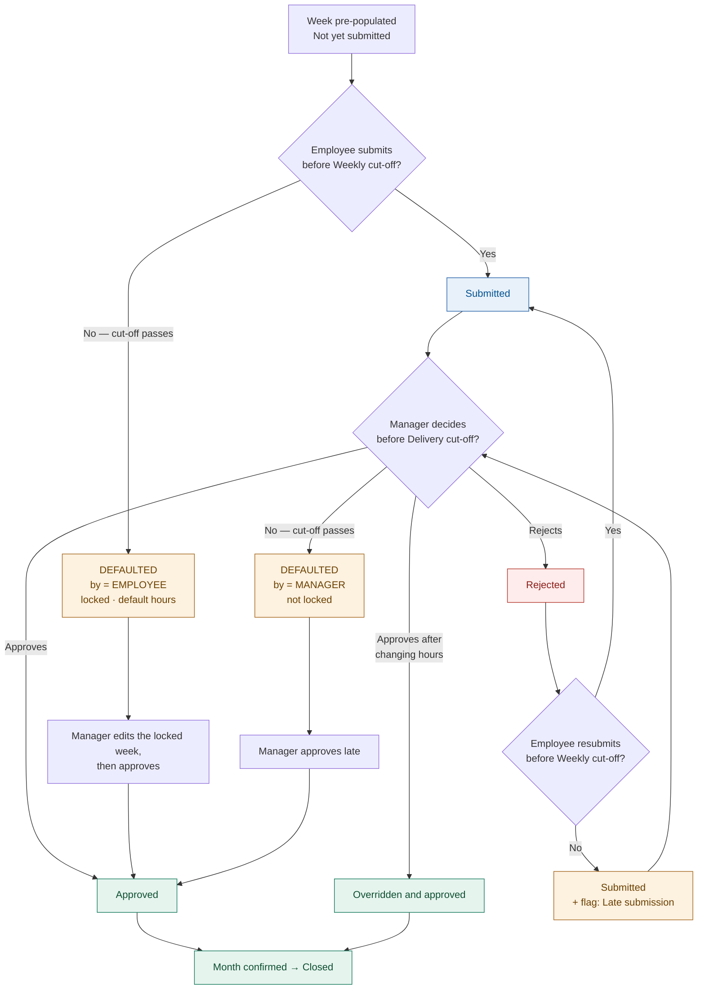
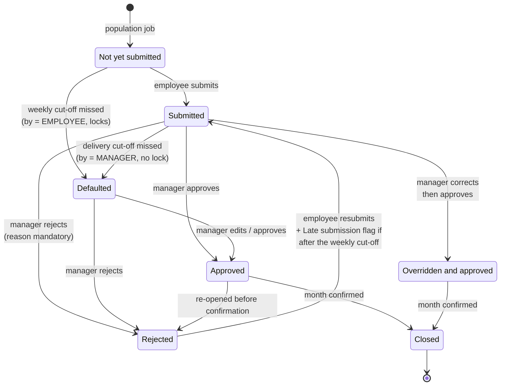

# O2C Time — Status & Flag Model (revision 2)

> **Superseded, 05-Aug-2026.** The status and flag model has been simplified since
> this was written. There is now **one set of six statuses** used at every level —
> Not yet submitted, Submitted, Approved, Rejected, Defaulted, Overridden and
> approved — with no separate scheme for a day, a week or a month. **`Closed` has
> been removed** (month confirmation is an event, recorded in
> `OC_TS_MONTH_CONFIRM`, not a status), and **salary hold is out of scope for now**.
> Status and flags are now shown in a single diagram.
>
>
> **Further, 06-Aug-2026.** The set is now **five** statuses, not six —
> *Overridden and approved* has been dropped: an override changes the hours, the
> outcome is still *Approved*, and that it was overridden is recorded by the flag.
> A **`Revoked`** flag has been added for a withdrawn submission or an undone
> decision. And **writing to the accrual staging table no longer requires manager
> approval** — an accrual covers work done, approved or not; the Project Costing
> post still requires it.
> Current model: **`doc/O2C_Time_Scope_and_Integration.html`** §3.2, §3.3 and §7,
> or its Word copy. This file is kept for the reasoning behind the earlier revision.

> For sign-off before code changes. Supersedes the 9-status / 8-flag model in
> `O2C_Timesheet_Requirements_Metadata_COMPLETE.xlsx` (Data_Dictionaries).
>
> Drafted 30-Jul-2026 from the change list of the same date.

**Result: 7 statuses (was 9), 6 flags (was 8).**

---

## 1. One thing to confirm first

Your change list arrived in two parts and they disagree on one point:

| | Earlier | Latest | Taken as |
|---|---|---|---|
| Late submission | "*is again defaulted only*" — i.e. it disappears, a late submit becomes **Defaulted** | "*status is submitted but flag is late submission*" — i.e. it survives as a **flag** | **Latest wins.** Late submission is a FLAG. A late submit is `Submitted` + `Late submission`. |

That is the model documented below. Say if the earlier reading was the intended
one, because it changes the salary-stopping behaviour materially — under the
earlier reading a late resubmission would hold the employee's pay.

---

## 2. Statuses — 7

A week has exactly one status. It is a `CHECK` constraint on `OC_TS_WEEK`, so an
invalid value cannot be stored.

| Status | Means | Set by | Employee may edit | Week locked |
|---|---|---|---|---|
| `Not yet submitted` | Pre-populated from allocation; employee has not submitted | Population job | **Yes** | No |
| `Submitted` | With the manager, awaiting a decision | Employee (submit / resubmit) | No | No |
| `Approved` | Manager approved as submitted | Manager | No | No |
| `Rejected` | Manager rejected; back with the employee to fix | Manager | **Yes** | No |
| `Defaulted` | A cut-off was missed — see §4 | **Defaulting jobs only** | No | Yes, if employee-caused |
| `Overridden and approved` | Manager changed the hours, then approved | Manager | No | No |
| `Closed` | Month confirmed and handed to accrual | Month confirmation | No | Yes |

**Removed from the original 9:**

| Was | Now |
|---|---|
| `Late submission` | A **flag**, not a status. The week is `Submitted`. |
| `Manager Defaulted` | `Defaulted`, with `DEFAULTED_BY = 'MANAGER'`. |

**The important consequence:** `Defaulted` is now produced *only* by the two
defaulting jobs. Nothing an employee does can put their own week into a defaulted
state — submitting late gets them `Submitted` + a flag, never `Defaulted`.

---

## 3. Flags — 6

Flags are independent of status and several can be set at once. The first four are
**sticky** — once true they stay true, because they record that something happened,
not the current state. The last two are **derived** and recomputed whenever the
week's entries change.

| Flag | Means | Set by | Sticky |
|---|---|---|---|
| `Defaulted` | This week defaulted at some point | Defaulting jobs | Yes |
| `Late submission` | Submitted or resubmitted **after** the weekly cut-off | Submit | Yes |
| `Advance closure` | Month approved before the work happened (PROC-010) | Advance approve | Yes |
| `Overridden & approved` | Manager changed hours before approving | Override | Yes |
| `Reversal` | Week contains a `Reversal(−)` entry | Entry rollup trigger | Derived |
| `Adjustment` | Week contains an `Adjustment(+)` entry | Entry rollup trigger | Derived |

**Removed from the original 8:**

| Was | Why it went | Where the information lives now |
|---|---|---|
| `Cancel` | Renamed | Now `Reversal`. "Cancel" read like a button the user presses; this is an accounting reversal that nets off against its Adjustment pair. |
| `Correction` | Dropped as a flag | `OC_TS_APPROVAL` logs a `Resubmit` action whenever a rejected week is resubmitted. **That is the audit trail** — nothing is lost. |
| `Contractor Unbilled hours` | Out of scope for the time module | Nothing. Contractors still exist as workers with their own role; we simply no longer flag their non-billable hours. |

> `Defaulted` and `Overridden & approved` appear as **both** a status and a flag —
> that came from the original metadata and I have kept it. Worth a decision: it is
> redundant, and the flag is the more useful of the two because it survives the
> week later becoming `Approved`.

---

## 4. The two cut-offs

Only two cut-offs affect a timesheet. Missing either one — or both — produces
`Defaulted`.

| Cut-off | Whose | Missing it means |
|---|---|---|
| **Weekly** | Employee | They never submitted. Week auto-submits with default hours, `Defaulted`, and **locks** — only a manager can then edit it. |
| **Delivery** | Manager | They never approved a submitted week. Week becomes `Defaulted` but is **not** locked — the manager can still approve it late. |

The other five cut-offs in Period Control (Finance, Book, MEC, Client, Payroll)
drive downstream finance and payroll, not timesheet status.

---

## 5. Status lifecycle

---

## 6. Your scenario #5, walked through

> *"if the manager rejects and employee submitted before the weekly cutoff then
> its submitted and if submitted after the cutoff its status is submitted but flag
> is late submission"*

Take week 3 of July 2026 (Mon 13 – Sun 19). Weekly cut-off is Monday 17:00, so the
cut-off for that week is **Mon 20-Jul 17:00**.

| Step | When | Status | Flags | Audit trail |
|---|---|---|---|---|
| Employee submits | Fri 17-Jul | `Submitted` | — | `Submit` |
| Manager rejects | Sat 18-Jul | `Rejected` | — | `Reject` + reason + remarks |
| **Case A** — employee resubmits | Mon 20-Jul 09:00 (**before** cut-off) | `Submitted` | — | `Resubmit` |
| **Case B** — employee resubmits | Tue 21-Jul 09:00 (**after** cut-off) | `Submitted` | `Late submission` | `Resubmit` |

In both cases the status is `Submitted` and the week goes back to the manager. The
only difference is the flag. And in both cases the `Resubmit` row in
`OC_TS_APPROVAL` is what tells you it was a correction — which is why the
`Correction` flag was safe to drop.

---

## 7. Three decisions I need from you

These follow from the changes and I do not want to guess.

### 7.1 Does a manager's lateness stop the employee's salary?

RULE-016 says *only `Defaulted` stops salary*, and the metadata is explicit that
"awaiting approval does **not** stop salary". But now a manager missing the
delivery cut-off also produces `Defaulted`. Taken literally, the employee's pay
would be held because their **manager** was slow — which inverts the rule.

**My proposal:** keep one status, add `DEFAULTED_BY` (`EMPLOYEE` | `MANAGER`), and
have salary stopping act only on `EMPLOYEE`. The screen still shows one
`Defaulted` badge; the distinction is internal.

**Confirm:** is that right, or should a manager-caused default hold pay too?

### 7.2 Can a `Defaulted` week be confirmed to accrual?

RULE-020 gates month confirmation on *every employee being `Approved`*. A
`Defaulted` week is not `Approved`, so today it would **block** the month. But
PROC-010 (advance close) says defaulted hours are "treated as approved", and
defaulted hours are meant to reach accrual as `ENTRY_TYPE = 'Default'`.

**Options:**
- **(a)** `Defaulted` blocks confirmation — the manager must edit and approve it first. Safer; the month never closes on hours nobody looked at.
- **(b)** `Defaulted` counts as approved for confirmation. Faster close; matches advance-close wording.

**My recommendation: (a)**, with advance close as the explicit exception — because
(b) means default hours can reach revenue with no human decision at all.

### 7.3 Keep `Defaulted` and `Overridden & approved` as both status *and* flag?

Both currently exist in each list. The flag is more useful (it survives the week
later becoming `Approved`); the status is what the UI badges. Keeping both is
harmless but redundant. Happy either way — just want it deliberate.

---

## 8. What this changes in the build

Nothing yet, beyond keeping the schema compilable. For visibility, once signed off:

| Layer | Change |
|---|---|
| `OC_TS_WEEK` | Status `CHECK` 9 → 7 values; drop `CORRECTION_FLAG`, `CONTRACTOR_UNBILLED_FLAG`; rename `HAS_CANCEL_FLAG` → `HAS_REVERSAL_FLAG`; add `DEFAULTED_BY` (pending §7.1) |
| `OC_TS_ENTRY` | `ENTRY_TYPE` `'Cancel'` → `'Reversal'` |
| `XX_O2C_TIMESHEET_ACCRUAL_IF` | Same rename, and the sign rule that keys off it |
| `OC_TIME_PKG` | `submit_week` always yields `Submitted`; **new** manager-defaulting job for the delivery cut-off; salary stopping filters on `DEFAULTED_BY` |
| Seed dictionaries | Status and flag lists rewritten |
| ORDS + 11 VBCS pages | Dropped flags removed from projections, types and badges |

### One thing to note

The `Cancel` → `Reversal` rename has already been applied across the codebase
(the two changes least likely to be contentious). That pass also touched
`O2C_Timesheet_Module.html` and `O2C_Timesheet_User_Journey.html` — the prototype
and user-journey files sitting in `O2C_Time/`. Those are your reference inputs
rather than build output, they are not git-tracked, so I cannot restore them. Only
`Cancel`-related label text changed (10 and 6 lines). Tell me if you want them put
back and I will reconstruct those labels by hand.
